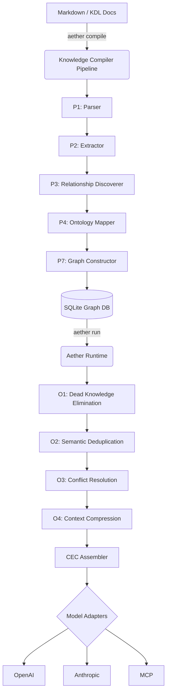

# Project Aether 🌌


> **The Knowledge Computing Platform for Agentic AI.**

Aether is a next-generation compiler that treats human knowledge, constraints, and architecture as source code. It parses your project's markdown and Knowledge Definition Language (`.kdl`) files, compiles them into a strict Enterprise Knowledge Graph (EKG), and dynamically generates hyper-optimized contexts for AI Agents at runtime.

No more RAG hallucinations. No more LLM context window bloat. Just pure, deterministic knowledge injection.

## 🚀 Features

- **Multi-Format Compiler**: Parses standard Markdown and strict `.kdl` files into a unified AST.
- **Semantic Knowledge Graph**: Discovers relationships (`DependsOn`, `ConflictsWith`) and maps them strictly using graphology.
- **Optimization Engine**: Automatically deduplicates rules, resolves priority conflicts (Mandatory > Recommended), and compresses context to fit LLM budgets.
- **SQLite Persistence**: Fully persists the compiled Knowledge Graph to a local database (`.aether/graph.db`).
- **REST API Server**: Exposes compiler and runtime via Fastify (`aether serve`).
- **Universal Adapters**: Out-of-the-box payload generation for OpenAI, Anthropic Claude, and the Model Context Protocol (MCP).

## 🏗️ Architecture



## 📦 Installation

```bash
# Clone the repository
git clone https://github.com/hacktronaut/project-aether.git
cd project-aether

# Install dependencies (requires Node.js 20+)
npm install

# Build the monorepo
npm run build
```

## 🛠️ Quick Start

### 1. Compile your Knowledge Base
Point Aether at a directory containing your project's markdown or `.kdl` specifications:
```bash
npx aether compile ./docs -o ./.aether/graph.db
```

### 2. Run a Mission
Execute a natural language mission against your compiled knowledge graph. Aether will traverse the graph, optimize the context, and output a Compiled Execution Context (CEC) payload for your LLM:
```bash
npx aether run --mission "Implement the new JWT authentication flow" --model gpt-4o --budget 20
```

### 3. Start the REST API (Optional)
Run Aether as a standalone service for your AI agents to query dynamically:
```bash
npx aether serve -p 3000
```
- `POST /compile`: Compile a new set of documents.
- `POST /mission`: Run a mission and return the optimized CEC.

## 📁 Monorepo Structure

- `@aether/core`: The heart of the system (Compiler, Runtime, Optimizations, Graph).
- `@aether/cli`: The command-line interface and Fastify REST API.
- `@aether/adapters`: Payload renderers for OpenAI, Anthropic, and MCP.
- `@aether/kdl`: Parser for the Knowledge Definition Language.

## 🤝 Contributing
Contributions are welcome! Please see `CONTRIBUTING.md` for guidelines. Run `npm test` to ensure all integration and unit tests pass before submitting a PR.
